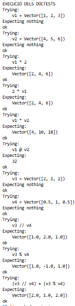

# Tercera tarea de APA: Multiplicación de vectores y ortogonalidad

## Nom i cognoms

Pau Pont Camp

## Aviso Importante

El objetivo de esta tarea es programar en Python usando el paradigma de la programación orientada a objeto. Es el alumno quien debe realizar esta programación. Existen bibliotecas que, sin lugar a dudas, lo harán mejor que él, pero su uso está prohibido.

## Fecha de entrega

6 de abril a medianoche

## Clase Vector e implementación de la multiplicación de vectores

El fichero `algebra/vectores.py` incluye la definición de la clase `Vector` con los métodos desarrollados en clase, que incluyen la construcción, representación y adición de vectores, entre otros.

En esta práctica se han añadido los siguientes métodos:

- Multiplicación de un vector por un escalar  
- Producto de Hadamard (multiplicación elemento a elemento)  
- Producto escalar (operador `@`)  
- Cálculo de la componente paralela (`//`)  
- Cálculo de la componente perpendicular (`%`)  

## Ejecución de los tests unitarios

A continuación se muestra la ejecución del fichero `algebra/vectores.py` en modo verboso:



## Código desarrollado

```python
class Vector:
    """Classe que representa un vector."""

    def __init__(self, iterable):
        """Construeix un vector a partir d'un iterable numèric."""
        self.vector = list(iterable)
        if not self.vector:
            raise ValueError("Un vector no pot ser buit.")
        if not all(isinstance(x, Real) for x in self.vector):
            raise TypeError("Totes les components han de ser numèriques.")

    def __repr__(self):
        """Retorna la representació oficial del vector."""
        return f"Vector({self.vector})"

    def __len__(self):
        """Retorna la dimensió del vector."""
        return len(self.vector)

    def __eq__(self, other):
        """Comprova si dos vectors són iguals."""
        return isinstance(other, Vector) and self.vector == other.vector

    def _check(self, other):
        """Comprova que l'operand sigui un vector de la mateixa dimensió."""
        if not isinstance(other, Vector):
            raise TypeError("L'operand ha de ser un vector.")
        if len(self) != len(other):
            raise ValueError("Els vectors han de tenir la mateixa dimensió.")

    def __add__(self, other):
        """Suma dos vectors component a component."""
        self._check(other)
        return Vector([a + b for a, b in zip(self.vector, other.vector)])

    def __sub__(self, other):
        """Resta dos vectors component a component."""
        self._check(other)
        return Vector([a - b for a, b in zip(self.vector, other.vector)])

    def __mul__(self, other):
        """Multiplica per un escalar o fa el producte de Hadamard."""
        if isinstance(other, Real):
            return Vector([x * other for x in self.vector])
        self._check(other)
        return Vector([a * b for a, b in zip(self.vector, other.vector)])

    def __rmul__(self, other):
        """Permet escalar * vector."""
        return self * other

    def __matmul__(self, other):
        """Calcula el producte escalar de dos vectors."""
        self._check(other)
        return sum(a * b for a, b in zip(self.vector, other.vector))

    def __floordiv__(self, other):
        """Retorna la component paral·lela respecte a un altre vector."""
        self._check(other)
        denom = other @ other
        if denom == 0:
            raise ValueError("No es pot projectar sobre el vector nul.")
        return ((self @ other) / denom) * other

    def __mod__(self, other):
        """Retorna la component perpendicular respecte a un altre vector."""
        return self - (self // other)


class TestVector(unittest.TestCase):
    """Tests unitaris de la classe Vector."""

    def test_multiplicacio_per_escalar(self):
        v1 = Vector([1, 2, 3])
        self.assertEqual(v1 * 2, Vector([2, 4, 6]))

    def test_multiplicacio_escalar_per_vector(self):
        v1 = Vector([1, 2, 3])
        self.assertEqual(2 * v1, Vector([2, 4, 6]))

    def test_producte_hadamard(self):
        v1 = Vector([1, 2, 3])
        v2 = Vector([4, 5, 6])
        self.assertEqual(v1 * v2, Vector([4, 10, 18]))

    def test_producte_escalar(self):
        v1 = Vector([1, 2, 3])
        v2 = Vector([4, 5, 6])
        self.assertEqual(v1 @ v2, 32)

    def test_component_paralela(self):
        v1 = Vector([2, 1, 2])
        v2 = Vector([0.5, 1, 0.5])
        self.assertEqual(v1 // v2, Vector([1.0, 2.0, 1.0]))

    def test_component_perpendicular(self):
        v1 = Vector([2, 1, 2])
        v2 = Vector([0.5, 1, 0.5])
        self.assertEqual(v1 % v2, Vector([1.0, -1.0, 1.0]))

    def test_descomposicio(self):
        v1 = Vector([2, 1, 2])
        v2 = Vector([0.5, 1, 0.5])
        self.assertEqual((v1 // v2) + (v1 % v2), Vector([2.0, 1.0, 2.0]))


if __name__ == "__main__":
    print("EXECUCIÓ DELS DOCTESTS")
    doctest.testmod(verbose=True)

    print("\nEXECUCIÓ DELS TESTS UNITARIS")
    unittest.main(verbosity=2)
